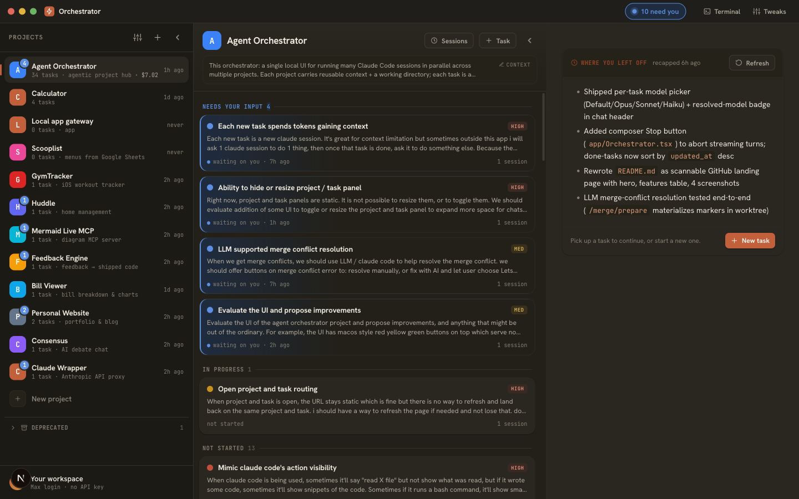
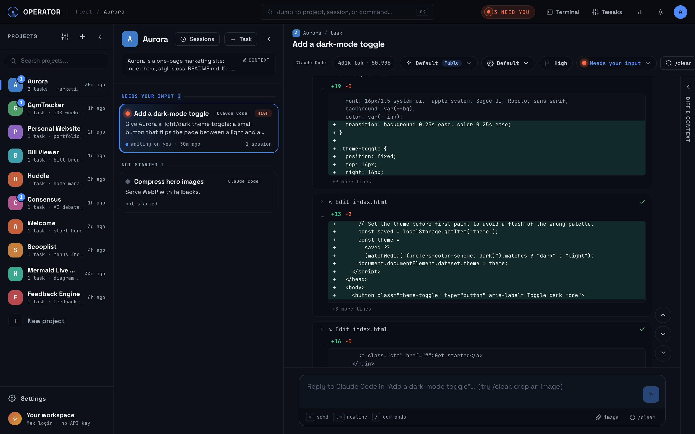
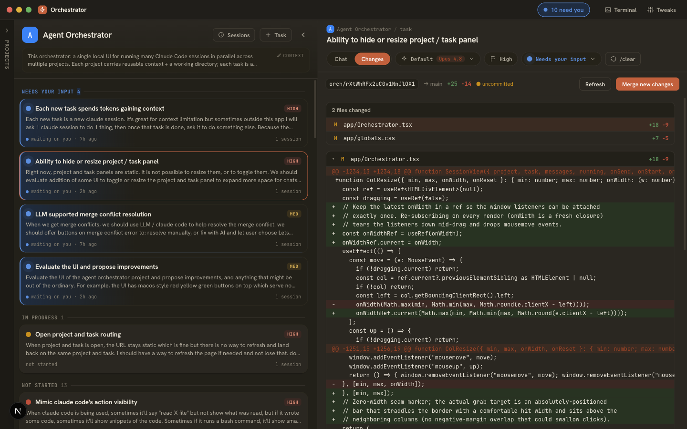
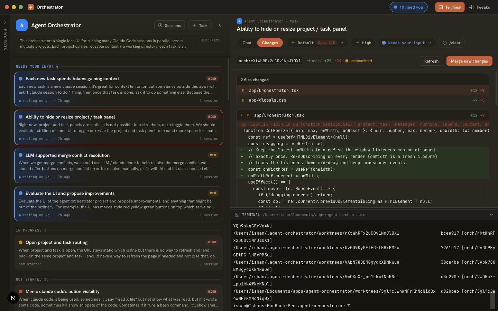

<div align="center">

# Operator

### Run many Claude Code sessions in parallel — across every project — from one screen.

Stop juggling terminals. Each **project** carries reusable context; each **task** is its own Claude Code session in its own git worktree. Drive ten in parallel, see exactly which one needs you, and review every diff before it merges.

Built on the **Claude Agent SDK**, driven by your **local Max/Pro login — no API key required, no per-token billing.**

[](LICENSE)
[](package.json)
[](CONTRIBUTING.md)

<!-- TODO(video): replace this screenshot with a 30–45s screen capture (GitHub hosts .mp4
     dragged into the README editor). Shot list: create a task → two tasks streaming at
     once → the "N NEED YOU" pill fires → jump to the task → review the diff → one-click
     merge. Keep the PNG below it as a fallback. -->


**[Quick start](#quick-start)** · **[Features](#features)** · **[Self-host with Docker](#running-it-in-docker-self-host)** · **[Configuration](#configuration)** · **[Hosted version](#hosted-version)** · **[Contributing](#contributing--security)**

</div>

---

## Why

You're paying for a 100×/200× Claude plan. The bottleneck isn't the model — it's *you*, tabbing between terminals, re-explaining context, and losing track of what's running where.

Operator removes that bottleneck:

- **Finally hit your plan's limits.** Run many sessions at once and make product decisions in parallel instead of one terminal at a time.
- **One screen for everything.** Every project and every task in a three-column workspace — no more "which terminal was that?"
- **Never repeat yourself.** Project context is written once and injected into every task; `/clear` hands a summary forward to the next session automatically.
- **Know exactly who needs you.** A live "needs your input" signal across *all* projects tells you which session is waiting — so parallel never means chaos.
- **Ship safely.** Each task runs in an isolated git worktree; review the diff and merge with one click (Claude resolves conflicts if they appear).

## Quick start

```bash
npm install
npm run dev      # web app on :3000 + node-pty terminal sidecar on 127.0.0.1:3001
# open http://localhost:3000
```

**Requirements:** Node 18.18+ (22 recommended) · macOS or Linux · the `claude` CLI
(`npm install -g @anthropic-ai/claude-code`) with a **Pro/Max** plan — the setup wizard
signs it in for you, headless included. Leave `ANTHROPIC_API_KEY` **unset** unless you
deliberately choose the wizard's API-key path; otherwise it takes precedence and bills
per-use instead of using your subscription.

**First run.** A brand-new instance opens a two-step **setup wizard**: connect Claude
(sign in with your Pro/Max account right in the UI — authorize link + paste-code field,
no terminal — or paste an API key) and verify it with a one-shot test turn. It's
resumable, skippable, and re-runnable from **Settings → Setup**. The wizard then lands
you in a seeded **Welcome** project — a tiny real repo with one ready task, *"Try me: add
a tagline"* — that walks the whole loop in about two minutes: streaming tool calls, a
question card, a one-file diff, a one-click merge. Delete it any time; it never re-seeds.

For your own projects, give each a real **working directory** — use **New project →
Clone from GitHub** (guided device-flow login, private repos included) or point it at a
local checkout.

App data lives **outside the repo**: `~/.zen-orchestrator` (SQLite) and
`~/.agent-orchestrator/worktrees` (per-task git worktrees) — the directory names keep the
app's pre-release codename — relocatable via `ORCH_DB_DIR` / `ORCH_WORKTREES_DIR`. Ports
taken? `PORT=3100 PTY_PORT=3101 npm run dev`. Other scripts: `npm run dev:next` (web
only) · `npm run pty` (sidecar only) · `npm run build && npm start` (production).

The browser talks to a **single origin**: `server.js` fronts Next.js and proxies the
terminal's WebSocket under `/pty`, so one tunneled https hostname carries both the app
and the terminal.

## Features

- ⚡ **True parallel sessions.** Every task is its own agent session in its own git worktree and branch. Run as many as your plan allows — each shows a pulsing live dot.
- 🔴 **"Needs your input," everywhere.** When a session stops mid-task: a coral alert dot, a per-project badge, and a cross-project **"N NEED YOU"** pill in the title bar. Claude's `AskUserQuestion` calls surface as inline answer cards.
- 🧠 **Write-once project context.** Per-project "what we're building" is auto-prepended to every task. When the codebase outgrows it, **Refresh with AI** reads the repo and drafts fresh context for your review.
- 🔗 **Session lineage.** `/clear` condenses the transcript to a summary and seeds a fresh context window with it — the task lives on across generations. Context overflow surfaces a one-click **Start fresh context** recovery.
- 🌿 **Diff review → one-click merge.** Review the task branch's full diff vs base beside the transcript, then merge with one click. Conflicts? **Fix with AI** runs a reviewed-by-you resolution turn; stale branches get one-click **Sync**.
- 🔀 **Pick your agent per task.** Each task runs on **Claude Code** or **Codex** (ChatGPT-plan login, same no-API-key flow). Model / reasoning / permission controls, context gauge, and cost display all adapt to the selected agent's capabilities.
- 🔌 **Reconnect-safe turns, queued follow-ups.** Turns run server-side, detached from the browser — reload, sleep the laptop, drop the tunnel; the transcript catches up. Type while a turn runs and it queues to execute next, in order.
- 🖥 **Integrated terminal + dev servers.** A real shell (xterm + node-pty) in a bottom drawer, rooted in the project. Per-project `dev`/`setup`/`test` commands run as supervised processes that outlive the turn and the tab, with live logs and a stable `PORT`.

<details>
<summary><b>Everything else</b></summary>

- 🎓 **Built-in tutorial** — the seeded Welcome project described in Quick start, plus coach marks for the three-column loop.
- 🖼️ **Image & large-paste attachments** — drag/paste images into the chat (stored outside the worktree, never in your diff); pastes over ~100 KB become file attachments read on demand so they can't blow the context window.
- 💸 **Token & cost tracking** — live cumulative tokens + dollar spend per task, rolled up per project.
- 📊 **Insights dashboard** — daily spend, tokens, tasks shipped, and lines merged, filterable by period / project / agent, computed locally from the usage ledger. Dollar figures are API-equivalent cost, not a bill.
- ✦ **Claude-suggested tasks** — Claude proposes follow-up work via `suggest_task`; it lands in a Suggested tray to edit, accept, or start.
- 🔒 **Task dependencies** — mark a task blocked-by others (cycle-guarded); its Start unlocks when every blocker is Done.
- 🐙 **Connect GitHub & clone** — guided `gh` device-flow login from the UI, then clone any of your repos (private included) into a new project.
- 📌 **"Where you left off" recaps** — return to an idle project and get a short recap from task summaries + recent commits.
- 🧹 **Prune merged worktrees** — **Settings → Storage** reclaims disk from merged tasks; branches are kept by default so tasks stay reopenable.
- ⏹ **Stop & cancel** — interrupt a streaming turn cleanly (partial transcript stays, task resumable); **Cancel** shelves an abandoned task but keeps its transcript, diff, and worktree — message it to revive.
- 🎛 **Niceties** — project reorder, deprecate/restore, session history, dark/light + accent + density themes, full markdown transcripts with syntax-highlighted, colored diffs.

</details>

### Live session

Chat on the right, watch tool calls stream in, drive the task to done.



### Review the diff, then merge

The **DIFF** tab shows the task branch vs base, side by side with the transcript — review every line, then **Merge** with one click.



### Integrated terminal — no extra window

A real shell rooted in the project's working dir, in a bottom drawer.



## How it compares

Operator is purpose-built around **Claude Code + your subscription**, and optimizes for the two things that actually slow down parallel agent work: **context continuity** and **knowing which session needs you**.

| Capability | **Operator** | Vibe Kanban | Plain Claude Code |
|-|-|-|-|
| Parallel sessions, isolated git worktrees | ✅ | ✅ | ❌ (manual) |
| Review diff before merge | ✅ | ✅ | ❌ |
| **Many projects on one screen** | ✅ | ➖ per-project | ❌ |
| **Reusable project context auto-injected** | ✅ | ❌ | ❌ |
| **Session lineage — `/clear` carries a summary forward** | ✅ | ❌ | ❌ |
| **Cross-project "needs your input" signal** | ✅ | ❌ | ❌ |
| **AI merge-conflict resolution** | ✅ | ❌ | ❌ |
| **"Where you left off" recaps** | ✅ | ❌ | ❌ |
| Claude-suggested next tasks | ✅ | ❌ | ❌ |
| Integrated terminal per project | ✅ | ➖ | n/a |
| Runs on your Max/Pro login, no API key | ✅ | depends on agent | ✅ |
| Multi-agent executors (Claude Code · Codex; Gemini / Cursor 🛣) | ✅ per-task picker | ✅ | ❌ |
| Kanban board view · GitHub PR creation | 🛣 roadmap | ✅ | ❌ |

<sub>Comparison reflects Vibe Kanban as of mid-2026 ([now community-maintained](https://github.com/BloopAI/vibe-kanban)). Operator prioritizes deep Claude Code integration and context continuity; Vibe Kanban prioritizes agent breadth and board-style workflows.</sub>

## Configuration

Every per-instance value is an env var with a documented default — one env set fully
relocates an instance with **zero code edits**. The vars you're most likely to touch:

| Variable | Default | What it does |
|-|-|-|
| `PORT` | `3000` | Port of the single public origin (Next.js + `/pty` proxy) |
| `PTY_PORT` | `3001` | Port of the node-pty terminal sidecar (loopback-only) |
| `PUBLIC_BASE_URL` | *(empty)* | The origin users reach the app on (e.g. `https://orch.example.com` behind a tunnel); empty = the browser's own origin |
| `ORCH_DB_DIR` | `~/.zen-orchestrator` | Directory holding `orchestrator.db` (SQLite app data) |
| `ORCH_WORKTREES_DIR` | `~/.agent-orchestrator/worktrees` | Where per-task git worktrees are created — must live outside any project repo |
| `ORCH_PROJECTS_DIR` | `~/projects` | Where **Clone from GitHub** puts cloned repos |
| `CLAUDE_CLI_PATH` | `~/.local/bin/claude` | Path to the logged-in `claude` CLI |

The full list — auth (`CF_ACCESS_*`, `SERVICE_TOKEN`), service ports, optional PostHog
analytics (off by default; no key set = nothing is ever sent), and more — lives in
[`.env.example`](.env.example), documented per variable. Export vars in the environment
that launches `npm run dev` / `npm start` — `server.js` and `pty-server.js` read them
before Next boots, so a `.env` file alone doesn't cover `PORT`/`HOSTNAME`/`PTY_*`.

```bash
# Example: relocate an instance entirely via env
PORT=8080 PTY_PORT=8081 \
PUBLIC_BASE_URL=https://orch.example.com \
ORCH_DB_DIR=/data/orchestrator \
ORCH_WORKTREES_DIR=/data/worktrees \
CLAUDE_CLI_PATH=/usr/local/bin/claude \
npm start
```

## Running it in Docker (self-host)

The [`Dockerfile`](Dockerfile) builds a single-user image: a **production** Next.js build
(a stopped container starts in seconds) bundling Node 22, git, and the `claude` CLI, with
[`docker/entrypoint.sh`](docker/entrypoint.sh) running both processes under tini. All
state lives under `/home/orch` — one named volume captures the SQLite db, worktrees,
project repos, and claude login. [`docker-compose.yml`](docker-compose.yml) is the
parameterized runner:

```bash
docker build -t agent-orchestrator .
ORCH_USER=alice ORCH_PORT=10001 ORCH_RUNTIME=runc \
  docker compose -p orch-alice up -d
# open http://127.0.0.1:10001
```

The container publishes its port on the **host's loopback only**. To reach it from
elsewhere, put an authenticated tunnel or reverse proxy in front — this app hands out a
full shell and a `bypassPermissions` agent, so **never expose the port raw**.

**Origin-side auth (optional)** — if you front an instance with Cloudflare Access, set
`CF_ACCESS_TEAM_DOMAIN` + `CF_ACCESS_AUD` and the origin re-verifies the Access JWT on
**every HTTP route** (Next.js middleware) **and every WebSocket upgrade** (`server.js`,
in front of the `/pty` terminal proxy). No valid assertion → 403.
[`lib/cf-access.mjs`](lib/cf-access.mjs) is the single shared verifier. Unset (the local
default), the app runs open — fine on your own machine, not on a public port. The one
exception: `SERVICE_TOKEN` lets health probes read `GET /api/instance/idle` — and only
that route — without an Access JWT.

**Idle signal** — `GET /api/instance/idle` reports whether the instance can be safely
stopped (live turns, open streams, terminal sockets, awaiting-input tasks, last-request
timestamp). Polling it doesn't count as activity; the image uses it as its `HEALTHCHECK`,
and an external supervisor can use it to stop/start idle containers.

## Hosted version

Don't want to run a server? **[getoperator.dev](https://getoperator.dev)** is the hosted
version of this app: sign up and get your own always-on, hardened instance
(gVisor-isolated container, Cloudflare-tunneled hostname, sleep/wake economics) — works
from your phone, survives your laptop closing, zero setup. It runs this same codebase
plus a closed-source provisioning/billing control plane.

## How it works

**A task is a lineage of sessions.** Generation N ends at `/clear`; its transcript is
condensed to a summary, and generation N+1 starts with a clean context window seeded by
all prior summaries. The task persists — only the context window resets.

**Where data lives**

| What | Where |
|-|-|
| Projects, tasks, transcripts, summaries | `orchestrator.db` (SQLite) in `ORCH_DB_DIR` |
| Per-task git worktrees | `ORCH_WORKTREES_DIR` — outside every repo |
| Your apps' actual code | each project's working directory — never inside Operator |
| Claude Code's raw session logs | `~/.claude/projects/...` (managed by Claude Code) |

**Stack:** Next.js (App Router) + TypeScript · React 19 · better-sqlite3 ·
`@anthropic-ai/claude-agent-sdk` · xterm.js + node-pty sidecar · streaming over SSE.

For the full picture — the turn lifecycle, the pluggable agent-driver seam (how Codex
support works and how to add a third agent), the MCP tool bridge, and the services
supervisor — see **[docs/ARCHITECTURE.md](docs/ARCHITECTURE.md)**.

## Contributing & security

Contributions welcome — see [CONTRIBUTING.md](CONTRIBUTING.md) (DCO sign-off, one change
per PR, `npm test` green). Please report vulnerabilities privately via GitHub Security
Advisories; [SECURITY.md](SECURITY.md) spells out the trust model and what counts.
Licensed [Apache-2.0](LICENSE).

## Notes & caveats

- **Permissions:** sessions run with `permissionMode: "bypassPermissions"` (`lib/agents/claude/driver.ts`) so they don't block on prompts. Switch to `"acceptEdits"` for a safety gate.
- **Parallel quota:** every concurrent task spends your rate limit — N tasks ≈ N× the token rate against one subscription.
- **Terminal:** the `node-pty` sidecar stays bound to `127.0.0.1` only — the browser reaches it through the app origin at `/pty`, so remote access goes through your one tunneled hostname.
- **Delete is hard delete:** a removed project's chat history is gone (your code on disk is untouched).
