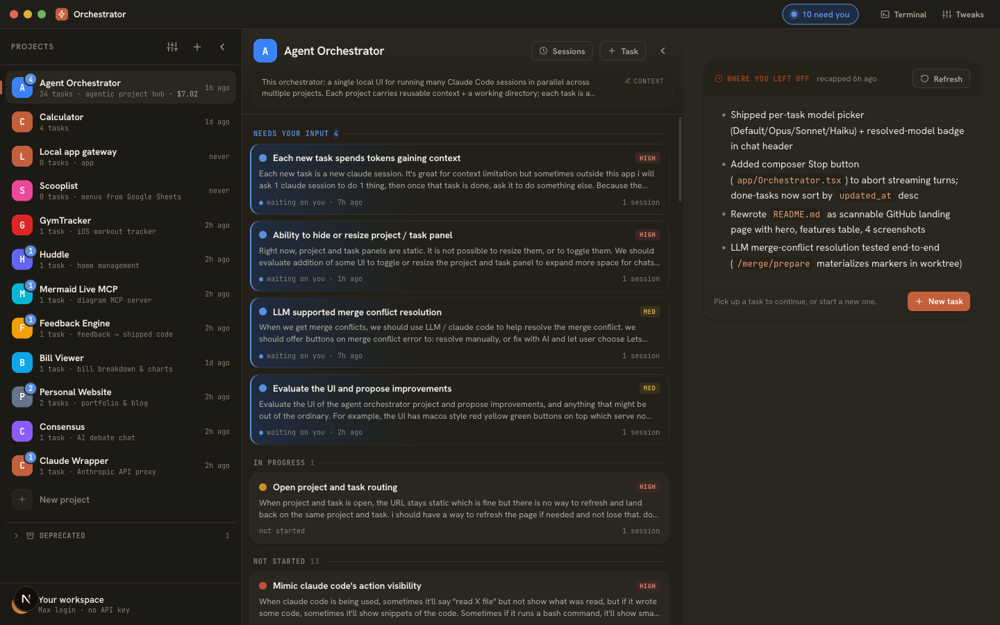
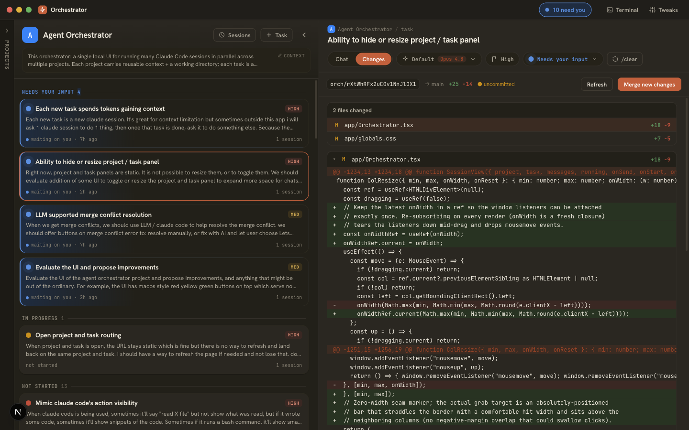

<div align="center">

# Operator

### Run Claude Code and Codex in parallel across every project, from any browser.

Operator is a web-based control room for your coding agents. 

Run it locally on your machine, self-host it on a server, or use our hosted version. A
deployed Operator workspace is available from your computer, tablet, or phone.

Every task gets a persistent agent session in an isolated git worktree. 

Operator uses your existing Max, Pro, or ChatGPT subscription, with no API key or per-token billing required.

[**Try Operator hosted**](https://getoperator.dev) · [**Run locally**](#run-locally) · [**Self-host**](docs/SELF_HOSTING.md) · [**Join Discord**](https://discord.gg/p4aaXvzJq2) · [**Request a feature**](https://github.com/iishyfishyy/operator-oss/discussions/categories/ideas)

[](https://discord.gg/p4aaXvzJq2)
[](LICENSE)
[](package.json)
[](CONTRIBUTING.md)



</div>

## Why Operator

- **Your workspace is wherever you are.** Deploy Operator once and manage agents from any
  device with a browser.
- **Run many tasks without juggling terminals.** Every task has its own worktree, branch,
  transcript, and agent session.
- **Know where you are needed.** A cross-project inbox surfaces sessions waiting for input
  while the rest keep working.
- **Stay in control of every change.** Review the diff beside the conversation, then merge,
  resolve conflicts, or open a pull request.

## How it works

**Create tasks → connect them into a pipeline → Operator gives each one an isolated worktree
and runs it when its dependencies finish → it alerts you when needed → you review and merge.**

Project context is written once and carried into each task. Server-owned turns and persisted
transcripts survive browser reloads and laptop sleep, and `/clear` starts a fresh context
window while preserving the task's lineage.

## What makes it different

- **Parallel, isolated tasks:** work across multiple repositories without agents mixing
  files or branches.
- **Web-based and self-hostable:** run Operator on your own machine or server, then securely
  access the same workspace from desktop or mobile.
- **One “Needs you” inbox:** jump directly to any session waiting for an answer.
- **Persistent context:** reuse project knowledge and continue long-running work across
  fresh context windows.
- **Review-to-merge workflow:** inspect diffs, sync branches, resolve conflicts, merge, or
  create a GitHub PR from the same screen.
- **Branching task pipelines:** make tasks depend on one or several earlier tasks, branch
  work into parallel paths, and launch each task automatically when its blockers finish.
- **A complete workspace:** chat, terminal, managed services, live logs, and transparent
  token and usage insights stay together.



[Explore all features](docs/FEATURES.md)

## Supported agents

Operator supports **Claude Code** and **OpenAI Codex** end to end. Choose an agent per task,
or connect only the one you use. Both work with subscription login; API keys remain an
optional explicit choice.

[Agent support, permissions, and usage details](docs/AGENTS.md)

## Run locally

You need Node 20.9+, macOS or Linux, and at least one supported agent CLI.

```bash
npm install
npm run build
npm start
```

Open <http://localhost:3000>. The first-run wizard connects Claude Code or Codex and takes
you through a short hands-on tutorial.

Use `npm run dev` only when developing Operator itself. For Docker, authentication,
networking, and secure access from anywhere, see the [self-hosting guide](docs/SELF_HOSTING.md).

## Hosted

[**getoperator.dev**](https://getoperator.dev) gives you an always-on Operator instance
with no server setup. Open it from any browser, including your phone, and return to the same
projects, tasks, and running agent sessions. It uses this open-source app with a hosted
control plane.

## Community

- [Join the Operator Discord](https://discord.gg/p4aaXvzJq2)
- [Request a feature or share an idea](https://github.com/iishyfishyy/operator-oss/discussions/categories/ideas)
- [Ask a question](https://github.com/iishyfishyy/operator-oss/discussions/categories/q-a)
- [Report a bug](https://github.com/iishyfishyy/operator-oss/issues/new?template=bug_report.yml)
- [Contribute](CONTRIBUTING.md)

See [COMMUNITY.md](docs/COMMUNITY.md) for where each kind of conversation belongs.

## Documentation

- [Installation and local development](docs/INSTALLATION.md)
- [Features](docs/FEATURES.md)
- [Agents](docs/AGENTS.md)
- [Insights and usage](docs/INSIGHTS.md)
- [Managed services](docs/SERVICES.md)
- [Self-hosting](docs/SELF_HOSTING.md)
- [Architecture](docs/ARCHITECTURE.md)
- [Security](SECURITY.md)

## License

[Apache-2.0](LICENSE)
