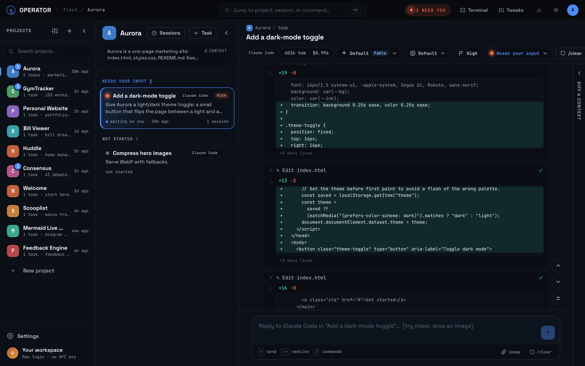
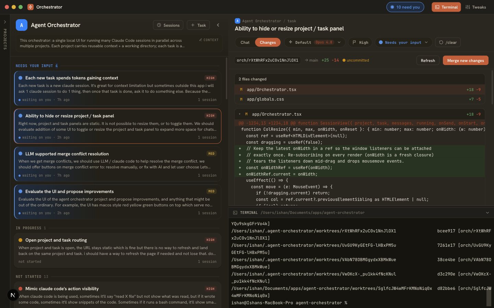

<div align="center">

# Operator

### Run many Claude Code sessions in parallel — across every project — from one screen.

Each **project** carries reusable context. Each **task** is its own agent session — **Claude Code** or **Codex** — in its own git worktree. Drive ten at once, see exactly which one needs you, review every diff before it merges. Runs on your **Max/Pro login** — no API key, no per-token billing.

[](LICENSE)
[](package.json)
[](CONTRIBUTING.md)

<!-- TODO(video): replace this screenshot with a 30–45s screen capture (GitHub hosts .mp4
     dragged into the README editor). Shot list: create a task → two tasks streaming at
     once → the "N NEED YOU" pill fires → jump to the task → review the diff → one-click
     merge. Keep the PNG below it as a fallback. -->


</div>

## Why

- Your Claude plan can run more than one session at a time — stop working it one terminal at a time.
- One screen for every project and every task. No tab-juggling.
- Project context is written once and injected into every task. Stop re-explaining your stack.
- A cross-project **"N need you"** signal shows exactly which session is waiting on you — and clears its badge once you've actually opened the task, so a fleet of finished sessions stops nagging as you work through them (parked questions keep counting until answered).

## Features

- **Parallel sessions** — every task is an isolated git worktree with its own agent session.
- **Diff review → one-click merge** — or AI conflict resolution, branch sync, and GitHub PR creation.
- **Pick your agent per task** — Claude Code or Codex, both on subscription logins.
- **Write-once project context** — auto-injected into every task; **Refresh with AI** redrafts it from the repo.
- **Session lineage** — `/clear` hands a summary to a fresh context window; the task lives on.
- **Reconnect-safe turns** — turns run server-side; reload or sleep the laptop and the transcript catches up. Queue follow-ups mid-turn.
- **Knows when your agent login dies** — an expired sign-in raises a workspace-wide banner with a one-click reconnect (plus the same button in the failed transcript). Queued follow-ups stay queued instead of failing one by one, and the banner clears itself the moment a turn runs again.
- **Integrated terminal + managed services** — a real shell per project, plus supervised dev/setup/test processes that survive restarts, with live logs and optional public URLs.
- **Honest usage tracking + insights** — live per-task tokens and spend, plus a local analytics dashboard. The chip leads with tokens the agent actually processed and keeps prompt-cache re-reads (usually most of the raw total) as secondary detail; on a subscription login the dollar figure is labelled as an API-price equivalent covered by your plan, not a bill.
- **List or kanban board** — flip the workspace to a full-width board of live status columns (Suggested / Not started / In progress / Needs input / Done); drag cards to reorder or change status, click one to open its session in a slide-over. ⌘⇧B toggles.
- Plus: agent-suggested tasks, task dependencies, image attachments, clone from GitHub, recaps, a first-run tutorial.

**Watch the session stream — tool calls, edits, questions:**



**Review the diff next to the chat, then merge (or open a PR):**


**A real terminal, right in the workspace:**



## Supported coding agents

| Agent | Status |
|-|-|
| **Claude Code** | Fully supported — the reference driver; every feature lands here first. |
| **OpenAI Codex** | Fully supported — parallel tasks, diff review/merge, `/clear` lineage, interactive questions (via the orchestrator's `ask_user` bridge), and cost tracking. Two caveats from the upstream CLI being non-interactive: dollar figures are **estimated** from token counts × published API prices (ChatGPT-plan auth reports tokens only — shown with a `~`), and there are no mid-turn *command approval* prompts, so the permission modes offered are Auto-run and Plan. [Issues welcome](https://github.com/iishyfishyy/operator-oss/issues). |

Want another agent? The driver seam is small — see [adding a new agent](docs/ARCHITECTURE.md).

## Insights

Open **Insights** from the top bar for a local analytics dashboard of what your agents cost and ship: per-day spend and token usage (including cache reads/writes), tasks shipped, and lines merged to base — sliceable by project and agent across 7/30/90-day ranges, with deltas against the prior period. Everything is computed from the local SQLite database in a single fetch, filter changes recompute instantly in the browser, and nothing is sent anywhere. Claude spend is the SDK-reported dollar figure; Codex spend is estimated from token counts at published API prices and marked with a `~`.

### Reading the numbers

The per-task chip in the session header reads `250k tok · 3.5M cached · ~$4.20`, and each part means something different:

| Part | What it means |
|-|-|
| `250k tok` | Tokens the agent processed for the first time: prompt, completion, and context written into the prompt cache. This is the headline because it's the work that actually happened. |
| `3.5M cached` | Prompt-cache **reads**: the conversation so far, re-sent every turn and billed at ~10% of the input rate. It dominates the raw token total on any long task and is not 3.5M tokens of new work. |
| `~$4.20` | On a **Max/Pro or ChatGPT subscription login** this is an *API-price equivalent*: what those tokens would have cost through the API. Your turns draw on plan quota, so the marginal cost is $0 and the figure carries a `~`. With an **API key** connected instead, it's a real billed amount and shows plainly. Codex figures are additionally estimated (its CLI reports tokens only). |

Hover the chip for the exact counts and the full breakdown.

## Managed services

Give a project `dev` / `setup` / `test` commands in its context editor (⚙) and the
**Services** drawer runs them as supervised processes **owned by the server** — not by an
agent turn or a browser tab — so `npm run dev` keeps serving after the turn ends and the
tab closes, with live logs on reconnect. Agents can also register servers they started
via the `expose_service` tool.

- Each project gets a stable port (`ORCH_SERVICE_PORT_BASE` + slot), injected as `PORT`
  into its services and PTY shell.
- Services are **persisted**: a dev server that was running is auto-restarted when the
  app boots. If the server died hard (`kill -9`, OOM), the next boot **reaps the orphaned
  process group** before respawning, so restarts never fight zombies for ports; a clean
  shutdown kills its service processes on the way out.
- If the configured port is already taken by an unmanaged process, the service shows a
  readable error in the drawer instead of crash-looping.
- Log capture is bounded per service (`ORCH_SERVICE_LOG_LINES`, default 1500 lines).
- A running service does **not** block idle-stop (`GET /api/instance/idle` reports
  `runningServices` informationally): stopping the instance is safe because services
  restart on boot at the same URL.

**Public URLs are a separate opt-in.** Set `ORCH_SERVICE_HOSTS=1` (plus
`PUBLIC_BASE_URL` and wildcard DNS/TLS) and each service gets a stable hostname
`<slug>--<your-host>` with per-service visibility — **private** (your session only),
**shared** (tokened link), or **public**. Enabling the services feature alone exposes
nothing. Frameworks with host checks see the hostname as `ORCH_PUBLIC_HOST` in the
service's env: Vite → `server.allowedHosts: [process.env.ORCH_PUBLIC_HOST]`, Next dev →
`allowedDevOrigins: [process.env.ORCH_PUBLIC_HOST]`; CRA/webpack-dev-server is
pre-cleared via env.

Managed services are on by default; `ORCH_FEATURE_SERVICES=0` turns the whole feature off.

## Quick start

```bash
npm install
npm run build
npm start
# open http://localhost:3000
```

This is the production build — use it whenever you're actually *using* the app.
Hacking on Operator itself? `npm run dev` runs the dev server (Turbopack + React dev
build) with hot reload — but it compiles each route on first hit and is **much slower**,
so don't run it for day-to-day use.

You need **Node 18.18+**, **macOS or Linux**, and at least one agent CLI: **Claude Code**
(`npm i -g @anthropic-ai/claude-code`, Pro/Max plan — recommended) or **Codex**
(`npm i -g @openai/codex`, ChatGPT plan). First run opens a setup wizard that signs the
agent in from the browser — connecting **either one** completes setup (it becomes the app
default and the tutorial runs on it) — then drops you into a 2-minute hands-on tutorial.
A stray `ANTHROPIC_API_KEY` / `OPENAI_API_KEY` in the launch environment is stripped at
boot (with a warning) so turns bill your subscription, not the API — set
`ORCH_ALLOW_API_KEY_ENV=1` if you really do want to run on an env-provided key.

Every setting is an env var with a sane default — see [`.env.example`](.env.example).

## Self-host

One hardened Docker container, built to sit behind an authenticated tunnel:

```bash
docker build -t agent-orchestrator .
ORCH_USER=alice ORCH_PORT=10001 docker compose -p orch-alice up -d
```

The port binds to loopback only — the app hands out a full shell, so put auth in front
and **never expose it raw**. Tunnels, Cloudflare Access, idle sleep, and every config
knob: [docs/SELF_HOSTING.md](docs/SELF_HOSTING.md).

## Hosted

Don't want to run a server? [**getoperator.dev**](https://getoperator.dev) is your own
always-on instance — works from your phone, zero setup. Same codebase plus a
closed-source control plane.

## Docs

- [Architecture](docs/ARCHITECTURE.md) — how it works; the agent-driver seam; adding a new agent
- [Self-hosting](docs/SELF_HOSTING.md) — Docker, auth, configuration, caveats
- [Contributing](CONTRIBUTING.md) · [Security](SECURITY.md)

## License

[Apache-2.0](LICENSE)
