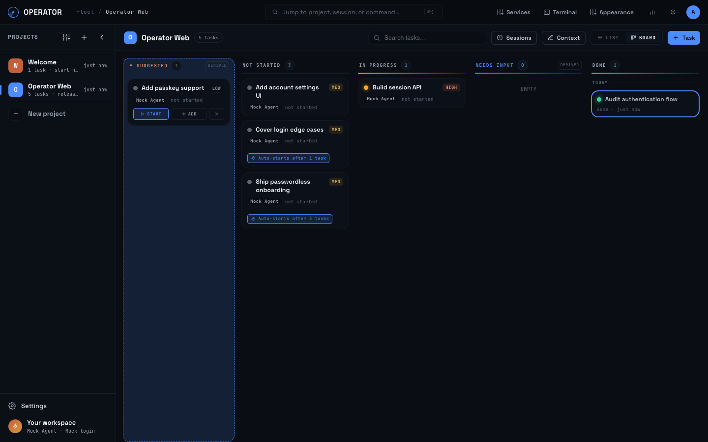
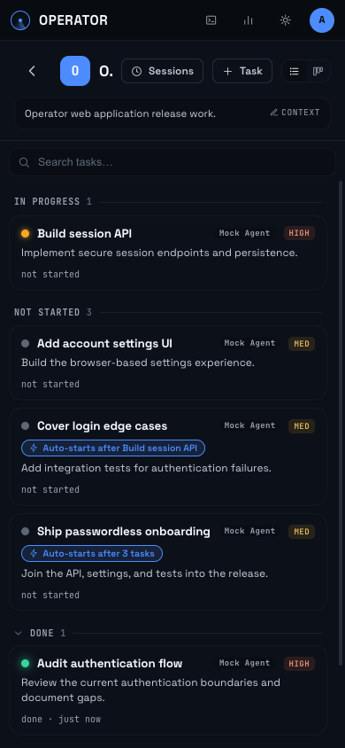

<div align="center">


# Operator

### Run Claude Code and Codex in parallel from any browser.

Operator is a web-based control room for coding agents. Every task gets a persistent agent
session in an isolated git worktree, so you can delegate across projects without juggling
terminals or mixing branches.

Run Operator on your own computer, self-host it on a server, or use the hosted version. A
deployed workspace is available from your computer, tablet, or phone.

[**Try hosted**](https://getoperator.dev) · [**Run locally**](#quick-start) · [**Self-host**](docs/SELF_HOSTING.md) · [**Docs**](#documentation) · [**Join Discord**](https://discord.gg/p4aaXvzJq2)

[](https://discord.gg/p4aaXvzJq2)
[](https://github.com/iishyfishyy/operator-oss/stargazers)
[](https://github.com/iishyfishyy/operator-oss/releases/latest)
[](LICENSE)


</div>

## One web workspace for every agent

- **Run tasks in parallel.** Each task has its own worktree, branch, transcript, and Claude
  Code or Codex session.
- **Know where you are needed.** One cross-project inbox surfaces every session waiting for
  your input while other agents keep working.
- **Keep context alive.** Save project knowledge once, persist transcripts across reloads,
  and use `/clear` to start a fresh context window without losing the task lineage.
- **Review before you ship.** Inspect the diff beside the conversation, sync the branch,
  resolve conflicts, merge, or open a pull request.

## Chain tasks into pipelines

Make a task depend on one or several earlier tasks. Work can branch into parallel paths,
then join again for final integration. Enable **Start when unblocked** and Operator launches
each task as soon as its last dependency finishes.

**Create tasks → connect dependencies → agents work in isolated branches → review and merge**



## Run it your way

| | Best for | Access |
|---|---|---|
| **Local** | Using Operator on one machine with the least setup | `localhost` in your browser |
| **Self-hosted** | An always-on workspace on infrastructure you control | Any authorized browser or device |
| **Hosted** | An always-on workspace without managing a server | [getoperator.dev](https://getoperator.dev) from any browser or device |

Operator is a web app in all three modes. Running locally keeps the app and its data on your
machine. Deploying it makes the same control room reachable wherever you are, including on
mobile.

<p align="center">
  
</p>

## Quick start

You need Node 20.9 or newer, macOS or Linux, and at least one supported agent CLI.

```bash
git clone https://github.com/iishyfishyy/operator-oss.git
cd operator-oss
npm install
npm run build
npm start
```

Open <http://localhost:3000>. The first-run wizard connects Claude Code or Codex and guides
you through a small real task. Both agents support subscription login, so an API key is not
required. API keys remain an explicit option.

For Docker, authentication, TLS, and secure access from outside your machine, follow the
[self-hosting guide](docs/SELF_HOSTING.md). Do not expose an unauthenticated Operator origin
to a network.

## More than chat

Operator also includes list and kanban views, agent-suggested follow-up tasks, per-project
and per-task terminals, managed services with live logs, project recaps, and transparent
token and usage insights.

[Explore all features](docs/FEATURES.md) · [Compare agent support](docs/AGENTS.md) · [Read the architecture](docs/ARCHITECTURE.md)

## Community

[Join Discord](https://discord.gg/p4aaXvzJq2) to meet users and contributors, show what you
are building, and discuss Operator. Use
[GitHub Discussions](https://github.com/iishyfishyy/operator-oss/discussions/categories/ideas)
for feature requests, [GitHub Issues](https://github.com/iishyfishyy/operator-oss/issues/new?template=bug_report.yml)
for reproducible bugs, and [CONTRIBUTING.md](CONTRIBUTING.md) for pull requests.

## Documentation

[Install and develop](docs/INSTALLATION.md) · [Self-host](docs/SELF_HOSTING.md) · [Features](docs/FEATURES.md) · [Agents](docs/AGENTS.md) · [Changelog](CHANGELOG.md) · [Security](SECURITY.md) · [Community](docs/COMMUNITY.md)

## License

[Apache-2.0](LICENSE)
